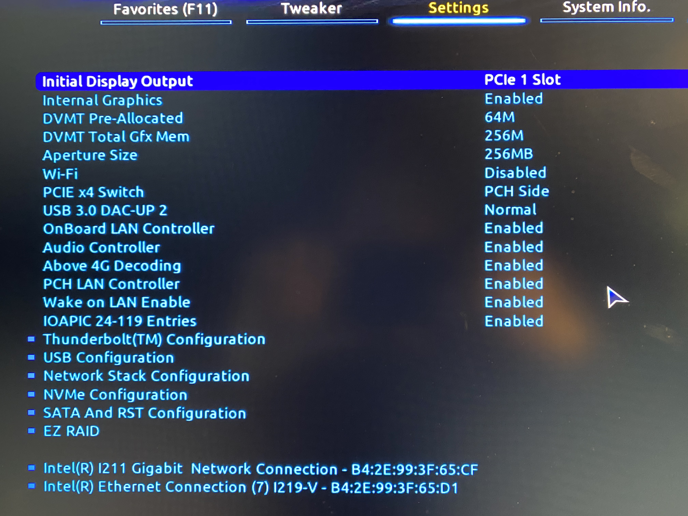
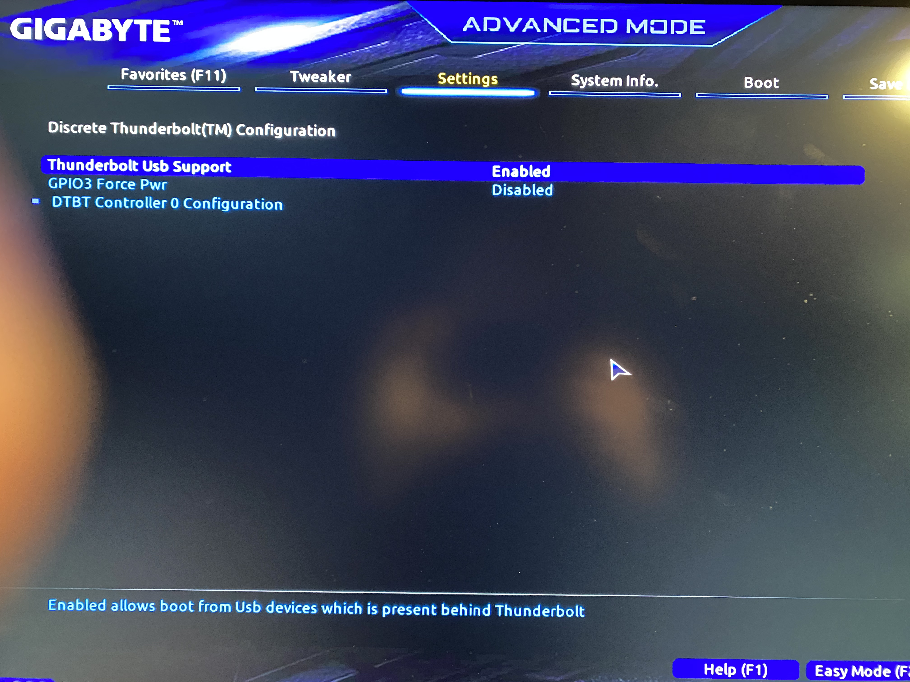
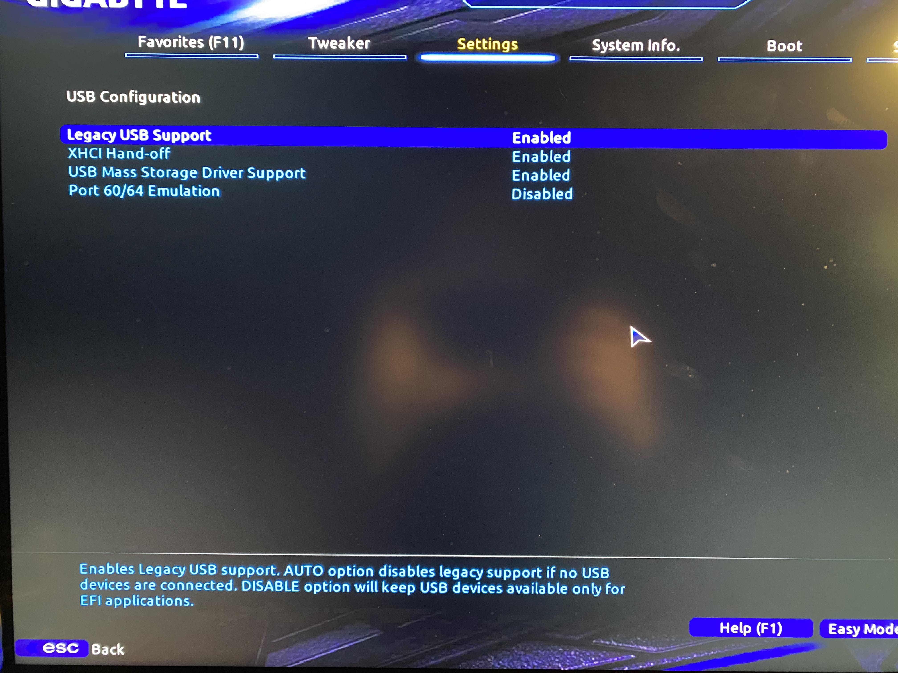
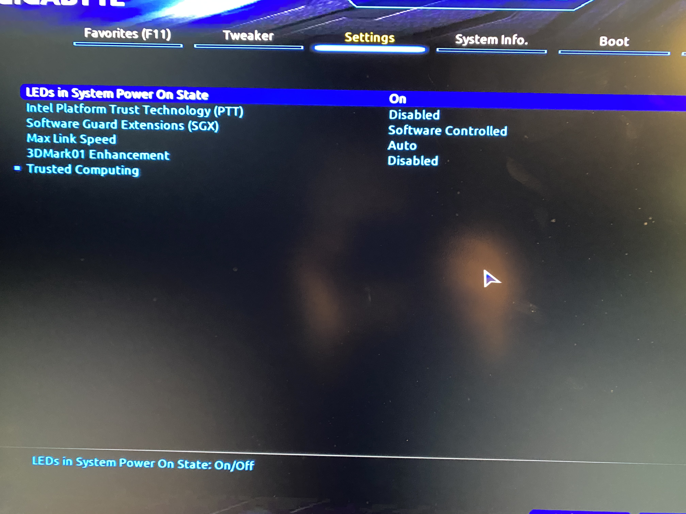
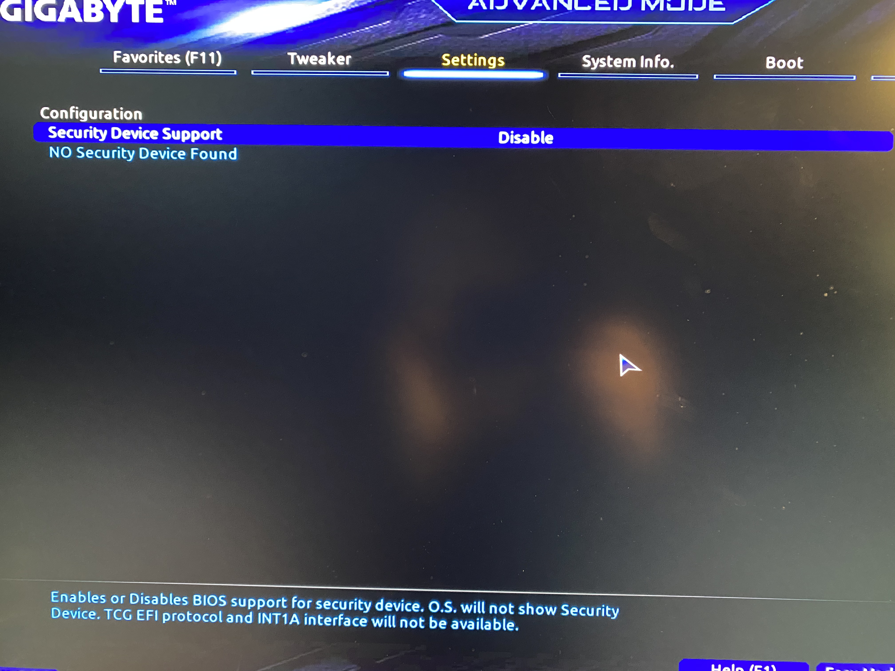
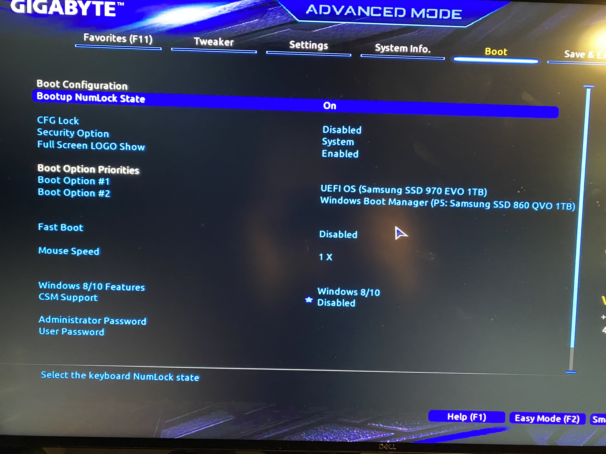

# BIOS Configuration

## About
I've taken pictures of the important screens of the BIOS. Settings that I've explicitly called out below the associated pictures are important. All settinsg not explicitly mentioned are not important (I think).

## Shortcut
The easiest way to make sure you've got your BIOS configured correctly is to just download [my BIOS profile](https://github.com/baughmann/designaire-z390-intel-i9-9900k-opencore/raw/master/BIOS_Config), throw it on a FAT32-formatted USB, and then "Load Profile" on the "Boot" page of the BIOS. **You still need to update your BIOS to firmware version `F9i` manually before you do this!** (thanks @hellojere for #24)

I've taken pictures of the important screens of the BIOS. Settings that I've explicitly called out below the associated pictures are important. All settings not explicitly mentioned are not important (I think).

## Firmware Version

**My Version:** `F9i`

You can view available BIOS firmware releases for the Designaire Z390 [on Gigabyte's website](https://www.gigabyte.com/Motherboard/Z390-DESIGNARE-rev-10/support#support-dl-bios).

# Settings

## IO Ports

### Main

- **Internal Graphics:** `Enabled`
  - Needed for Sidecar (thanks @QueercoreTrash, [#19](https://github.com/baughmann/designaire-z390-intel-i9-9900k-opencore/issues/19))
- **Wi-Fi:** `Disabled`
  - Since this EFI no longer uses the custom `USBPorts.kext` for USB port mapping as of Big Sur, we need to disable the integrated BT/Wi-Fi card so the Fenvi can be used
- **Above 4G Encoding:** `Enabled`

### Thunderbolt Configuration

- **TBT Vt-d base security:** `Disabled`

### Discrete Thunderbolt Configuration

### USB Configuration

- **Legacy USB Support:** `Enabled`
- **XHCI Hand-off:** `Enabled`
- **USB Mass Storage Driver Support:** `Enabled`

## Miscellaneous

### Main

- **Intel Platform Trust Technology:** `Disabled`

### Trusted Computing

- **Security Device Support:** `Disable`

# Boot

- **CFG Lock:** `Disabled`
- **Fast Boot:** `Disabled`
- **Windows 8/10 Features:** `Windows 8/10`
- **CSM Support:** `Disabled`
