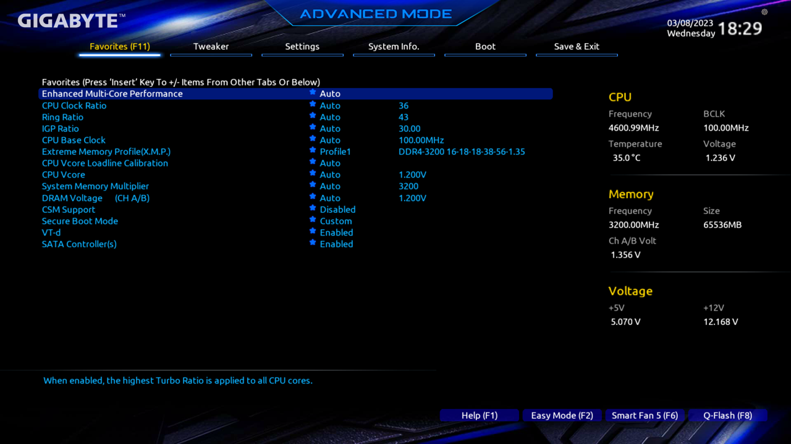
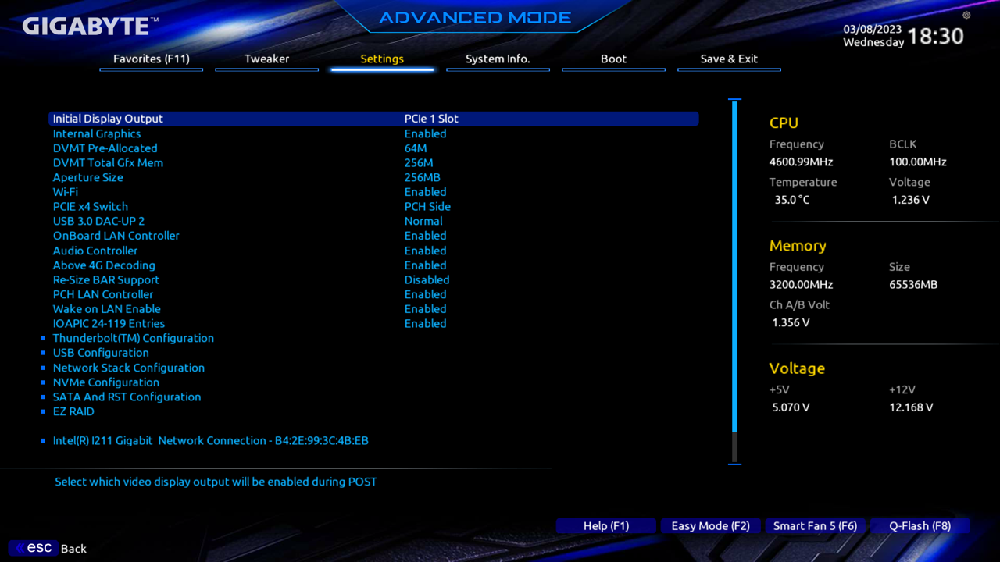
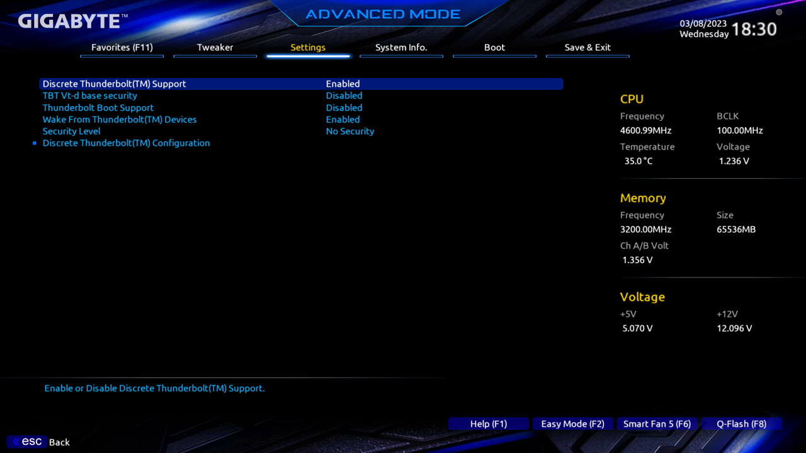
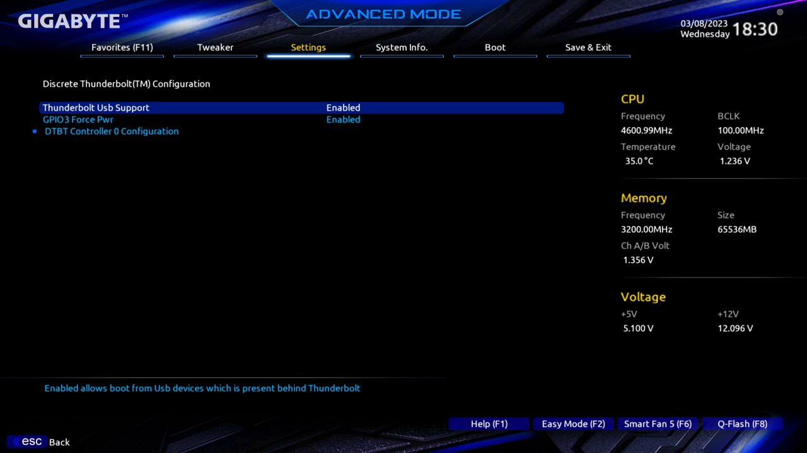
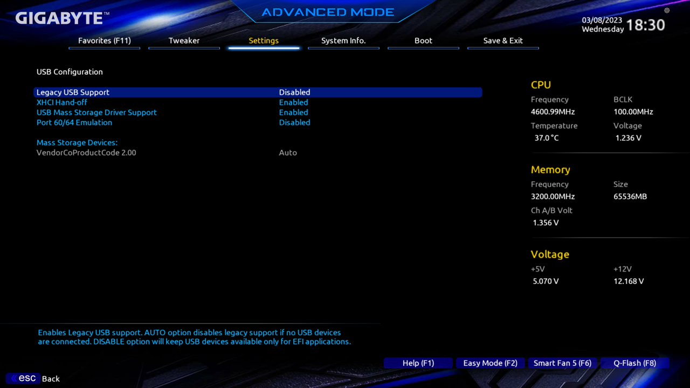
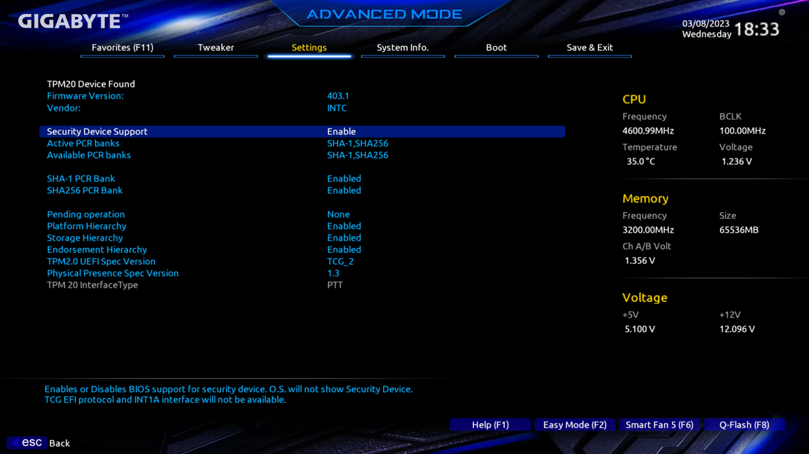
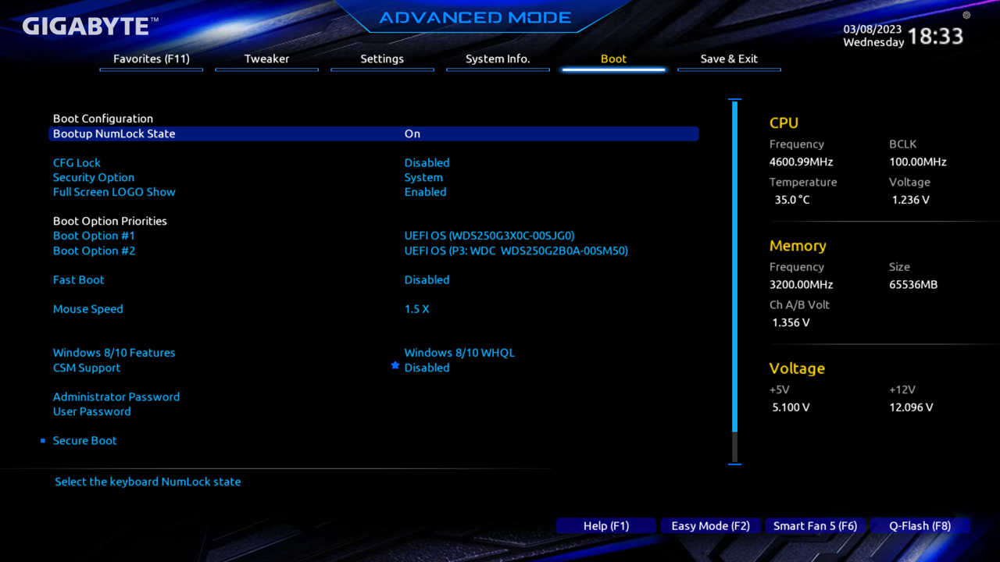
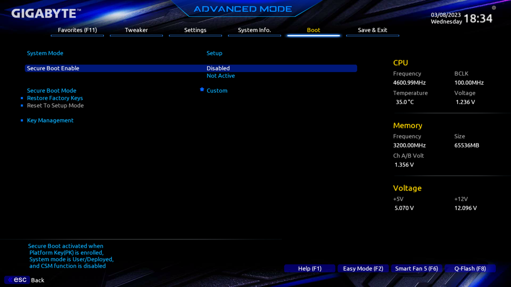

# BIOS Configuration

> ==============================
>
> **IMPORTANT NOTE:** The downloadable BIOS config file is for BIOS version **F9**. If you're using another BIOS version, you should set the values manually.
>
> ==============================

## NOTES
I've taken pictures of the important screens of the BIOS. Settings that I've explicitly called out below the associated pictures are important. You can also [refer to the guide](https://dortania.github.io/OpenCore-Install-Guide/config.plist/coffee-lake.html#intel-bios-settings). 

## Shortcut
The easiest way to make sure you've got your BIOS configured correctly is to just download [my BIOS profile](https://github.com/seven-of-eleven/designare-z390-opencore-efi/blob/master/Bios_Config_f9), throw it on a FAT32-formatted USB, and then "Load Profile" on the "Boot" page of the BIOS. **You still need to update your BIOS to firmware version `F9` manually before you do this!**. This also does not affect *all* settings, so please read through and make sure everything lines up manually.

If you have an older version of the BIOS, version F9i, then you will still need to set the values manually. Check the images folder and [OpenCore guide](https://dortania.github.io/OpenCore-Install-Guide/config.plist/coffee-lake.html#intel-bios-settings) for BIOS settings.

## Firmware Version

**My Version:** `F9`

You can view available BIOS firmware releases for the Z390 Designaire [on Gigabyte's website](https://www.gigabyte.com/Motherboard/Z390-DESIGNARE-rev-10/support#support-dl-bios).

# Favorites

- **Extreme Memory Profile (X.M.P.):** `Profile 1`
- **CSM Support:** `Disabled`
- **Vt-d:** `Enabled`

# Settings

## IO Ports

### Main

- **Internal Graphics:** `Enabled`
  - Needed for Sidecar (thanks @QueercoreTrash, [#19](https://github.com/baughmann/designaire-z390-intel-i9-9900k-opencore/issues/19))
- **Wi-Fi:** `Enabled` 
  - for internal Wi-Fi and bluetooth

- **Above 4G Encoding:** `Enabled`

### Thunderbolt Configuration

- **TBT Vt-d base security:** `Disabled`
- **Security Level:** `No Security`

### Discrete Thunderbolt Configuration

### USB Configuration

- **Legacy USB Support:** `Disabled`
- **XHCI Hand-off:** `Enabled`
- **USB Mass Storage Driver Support:** `Enabled`

## Miscellaneous

### Main

- **Intel Platform Trust Technology:** `Enabled`

### Trusted Computing

- **Security Device Support:** `Enabled`

# Boot

- **CFG Lock:** `Disabled`
- **Fast Boot:** `Disabled`
- **Windows 8/10 Features:** `Windows 8/10` WHQL
- **CSM Support:** `Disabled`

### Secure Boot

- **Secure Boot:** `Disabled`
