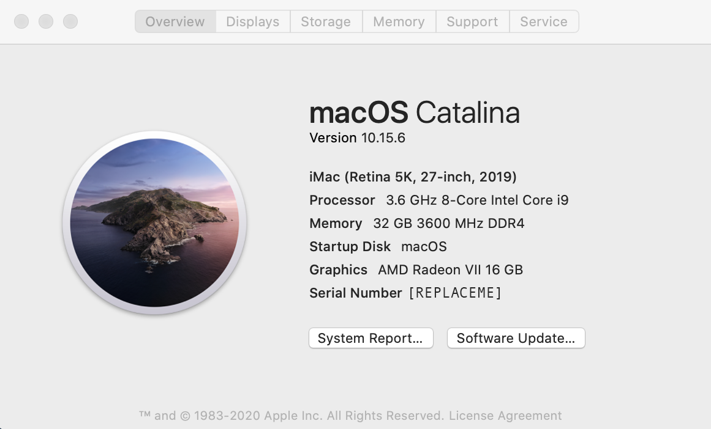

# Gigabyte Designaire Z390 - OpenCore - macOS Catalina

⭐️ **Thank you guys for all the stars!** ⭐️

## Table of contents

- [Features](https://github.com/baughmann/designaire-z390-intel-i9-9900k-opencore#features)
- [Hardware](https://github.com/baughmann/designaire-z390-intel-i9-9900k-opencore#hardware)
- [Functionality](https://github.com/baughmann/designaire-z390-intel-i9-9900k-opencore#functionality) (aka "what works" and "what doesn't work)
- [Installation](https://github.com/baughmann/designaire-z390-intel-i9-9900k-opencore#installation)
- [About the EFI](https://github.com/baughmann/designaire-z390-intel-i9-9900k-opencore#about-this-custom-efi)
- [Troubleshooting](https://github.com/baughmann/designaire-z390-intel-i9-9900k-opencore#troubleshooting)
- [Changelog](https://github.com/baughmann/designaire-z390-intel-i9-9900k-opencore#changelog)
- [Releases](https://github.com/baughmann/designaire-z390-intel-i9-9900k-opencore/releases)
- [Issues](https://github.com/baughmann/designaire-z390-intel-i9-9900k-opencore/issues)

## Features

- macOS Catalina 10.15.6 (19G73)
- OpenCore 0.6.0 (release mode)
- OpenCanopy (boot UI)
- **_[Almost](https://github.com/baughmann/designaire-z390-intel-i9-9900k-opencore#installation)_** plug-n-play if you have [my hardware configuration](https://github.com/baughmann/designaire-z390-intel-i9-9900k-opencore#primary-system)
- Regularly updated
- Pretty stable (my every-day driver)
- I suffer so you don't have to! 👨‍🎤

> This EFI is a revision of the [previous Clover EFI](https://github.com/baughmann/Catalina-Gigabyte-Designare-Z390-i9-9900k-EFI) that I posted. Given that OpenCore has a definitive and always-up-to-date installation guide (a much welcome change from Clover), [you should read it](https://dortania.github.io/OpenCore-Desktop-Guide/) in addition to using this EFI.

---

## **Hardware**

#### Primary System

| Component | Product                           |
| --------- | --------------------------------- |
| CPU       | Intel Core i9 9900K               |
| MB        | Gigabyte Designaire Z390 (rev 10) |
| GPU       | AMD Radeon VII 16 GB              |
| SSD       | Samsung EVO 970 (NVMe - 1TB)      |
| BT/Wi-Fi  | Fenvi T919 Bluetooth/Wi-Fi Card   |

#### Verified Secondary System (changes needed)

I can also confirm that this basically also works on my wife's computer whose specs are below.

> ‼️ **Required Changes** ‼️
>
> Just remove the `USBPorts.kext` from the `config.plist` and the `kexts` directory and you _should_ be good to go/

| Component | Product                                 |
| --------- | --------------------------------------- |
| CPU       | Intel Core i7 8700K                     |
| MB        | Asus ROG Maximus X Hero (Wi-Fi AC) Z370 |
| GPU       | AMD Radeon VII 16 GB                    |
| SSD       | Samsung 860 EVO SSD (1TB)               |
| BT/Wi-Fi  | Fenvi T919 Bluetooth/Wi-Fi Card         |

#### Other Configurations

- [Without dedicated GPU](https://github.com/baughmann/Catalina-Gigabyte-Designare-Z390-i9-9900k-EFI/issues/1)
- Other AMD GPU's are _probably mostly_ plug-n-play. Be sure to read the [fantastic Buyer's Guide by Dortania](https://dortania.github.io/GPU-Buyers-Guide/) before you buy!.
- MacOS Big Sur Beta: According to [this issue](https://github.com/baughmann/designaire-z390-intel-i9-9900k-opencore/issues/6), this EFI reportedly works for the Big Sur beta with nearly no modifications. Additional confirmation required on base system.

---

## **Functionality**

#### **What works**

- Bluetooth & Wi-Fi
- AirDrop and other continuity features
- Audio (rear 3.5mm audio jack works, haven't tested the front)
- Shutdown / Restart / Sleep
- USB 3.0/3/1
- Thunderbold 3 (including charging and hotswapping)
- NVMe
- APFS (actually, APFS is required for this build)
- iMessage, AirDrop, etc.

#### **What doesn't work**

- Emulated NVRAM (it's a Z390 after all) ☹ - please comment on [the issue](https://github.com/baughmann/designaire-z390-intel-i9-9900k-opencore/issues/4) if you know of a resolution.

---

## **Installation**

#### **Customize the `config.plist`**

The following fields have been replaced by `[REPLACME]` (for ease of Cmd+F):

- `config.plist` > `PlatformInfo`
  - `SystemSerialNumber`
  - `SystemUUID`
  - `MLB`
    Follow these [instructions](https://dortania.github.io/OpenCore-Desktop-Guide/post-install/iservices.html#generate-a-new-serial) to generate your own unique identifiers. The AppleCare step is optional.

#### **Update your motherboard's BIOS firmware**

- Visit [Gigabyte's website](https://www.gigabyte.com/us/Motherboard/Z390-DESIGNARE-rev-10/support#support-dl-bios) and make sure you're running the lates version of the bios
  - I'm on version `F8` but any later version should work

#### **BIOS configuration**

This is by no means an extensive list. This is just some stuff unique to our BIOS.

The most important settings are:

- Udate to BIOS firmware version F8 or later.
- Disable:
  - CSM
  - SecureBoot
  - iGPU (onboard graphics)
- Enable
  - Above 4G decoding

---

## **About this custom EFI**

#### **Most important differences from The Official Guide**

The primary changes that I remember making that differ from the fantastic [OpenCore Desktop Guide for Coffee Lake](https://dortania.github.io/OpenCore-Desktop-Guide/config.plist/coffee-lake.html) are:

- boot args `slide=1 alcid=7`
- Adding my own USB map kext (`USBPorts.kext`) that shuts off the MoBo's built-in Wi-Fi card so that I can use the Fenvi
- Adding the `HfsPlus.efi` driver

---

## **Troubleshooting**

- Check your `config.plist` against the corresponding version using [this handy utility](https://opencore.slowgeek.com/).
- Read the officla [OpenCore Desktop Guide for Coffee Lake](https://dortania.github.io/OpenCore-Install-Guide/config.plist/coffee-lake.html) when making changes to the `config.plist` and the guide's [Gather Files section](https://dortania.github.io/OpenCore-Install-Guide/ktext.html#firmware-drivers) when picking drivers and kexts.
- [Post an issue](https://github.com/baughmann/designaire-z390-intel-i9-9900k-opencore/issues) and I will get back to you when I can. I should be able to be pretty helpful if you have similar hardware as I do.

## \*_Changelog_

- **4 August 2020:**
  - Updated OC to version [0.6.0](https://github.com/acidanthera/OpenCorePkg/releases/tag/0.6.0)
  - Updated all of [acidanthera's](https://github.com/acidanthera) drivers and kexts
- **1 August 2020:**
  - Updated OC to version [0.5.9](https://github.com/acidanthera/OpenCorePkg/releases/tag/0.5.9)
  - Updated all kexts and drivers to latest
  - Removed `ApfsDriverLoader.efi` because it was rolled into OC starting with 0.5.9
- **13 June 2020:**
  - Updated OC, Kernel Extensions, and Drivers to be compatible with latest macOS update `10.15.5` (and supplemental update).
  - Somehow the boot picker remembers my choice now, meaning that emulated NVRAM is somehow working?
  - _IMPORTANT:_ Upgraded from `DEBUG` to `RELEASE`:
    - Changed all drivers and OC files from the `DEBUG` versions to `RELEASE` versions because I seem to have a stable system.
    - Modified `config.plist` to no longer generate logs (log level now `0`).
    - If you're having problems, switch back to `DEBUG` mode yourself by following [this guide](https://dortania.github.io/OpenCore-Desktop-Guide/troubleshooting/debug.html).
