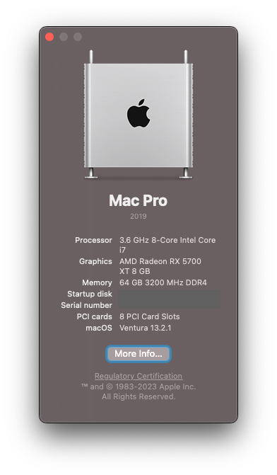
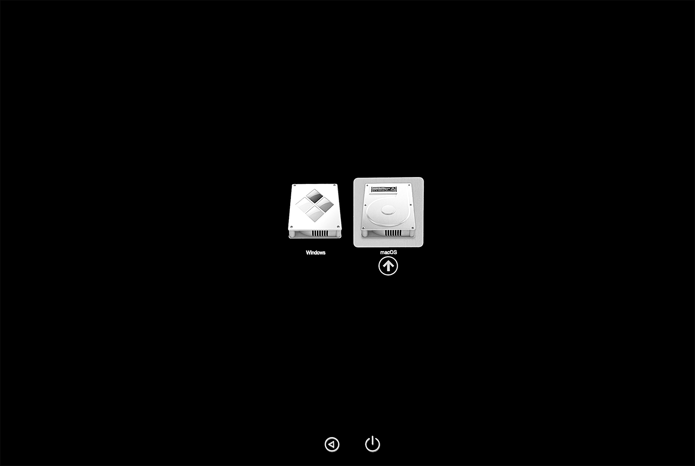

# Gigabyte Designaire Z390 Hackintosh - OpenCore - macOS Big Sur

⭐️ **Thank you guys for all the stars!** ⭐️

## Benchmarks (Geekbench)

CPU:

- Single-core: [1261](https://browser.geekbench.com/v5/cpu/4770586)
- Multi-core: [7901](https://browser.geekbench.com/v5/cpu/4770586)

Compute (GPU):

- Metals: [59488](https://browser.geekbench.com/v5/compute/1846110)
- OpenCL: [51655](https://browser.geekbench.com/v5/compute/1846114)

## Table of contents

- [Features](https://github.com/baughmann/designaire-z390-intel-i9-9900k-opencore#features)
- [Hardware](https://github.com/baughmann/designaire-z390-intel-i9-9900k-opencore#hardware)
- [Functionality](https://github.com/baughmann/designaire-z390-intel-i9-9900k-opencore#functionality) (aka "what works" and "what doesn't work)
- [Installation](https://github.com/baughmann/designaire-z390-intel-i9-9900k-opencore#installation)
- [About the EFI](https://github.com/baughmann/designaire-z390-intel-i9-9900k-opencore#about-this-custom-efi)
- [Troubleshooting](https://github.com/baughmann/designaire-z390-intel-i9-9900k-opencore#troubleshooting)
- [Changelog](https://github.com/baughmann/designaire-z390-intel-i9-9900k-opencore#changelog)
- [Releases](https://github.com/baughmann/designaire-z390-intel-i9-9900k-opencore/releases)
- [Issues](https://github.com/baughmann/designaire-z390-intel-i9-9900k-opencore/issues)

## Features

- macOS Big Sur 11.4 (20F71)
- OpenCore 0.6.9
- OpenCanopy
- **_[Almost](https://github.com/baughmann/designaire-z390-intel-i9-9900k-opencore#installation)_** plug-n-play if you have [my hardware configuration](https://github.com/baughmann/designaire-z390-intel-i9-9900k-opencore#primary-system)
- Regularly updated
- Pretty stable (my every-day driver)
- I suffer so you don't have to! 👨‍🎤

---

## **Hardware**

#### Primary System

| Component | Product                           |
| --------- | --------------------------------- |
| CPU       | Intel Core i9 9900K               |
| MB        | Gigabyte Designaire Z390 (rev 10) |
| GPU       | AMD Radeon VII 16 GB              |
| SSD       | Samsung EVO 970 (NVMe - 1TB)      |
| BT/Wi-Fi  | Fenvi T919 Bluetooth/Wi-Fi Card   |

#### Verified Secondary System

I can also confirm that this basically also works on my wife's computer whose specs are below.

| Component | Product                                 |
| --------- | --------------------------------------- |
| CPU       | Intel Core i7 8700K                     |
| MB        | Gigabyte Designaire Z390 (rev 10) |
| GPU       | AMD Radeon VII 16 GB                    |
| SSD       | Samsung 860 EVO SSD (1TB)               |
| BT/Wi-Fi  | Fenvi T919 Bluetooth/Wi-Fi Card         |

#### Other Configurations

- [Without a dedicated GPU](https://github.com/baughmann/Catalina-Gigabyte-Designare-Z390-i9-9900k-EFI/issues/1)
- Other AMD GPU's are _probably mostly_ plug-n-play. Be sure to read the [fantastic Buyer's Guide by Dortania](https://dortania.github.io/GPU-Buyers-Guide/) before you buy!.
- MacOS Big Sur Beta: According to [this issue](https://github.com/baughmann/designaire-z390-intel-i9-9900k-opencore/issues/6), this EFI reportedly works for the Big Sur beta with nearly no modifications. Additional confirmation required on the base system.

---

## **Functionality**

#### **What works**

- Bluetooth & Wi-Fi
- AirDrop and other continuity features
- Audio (rear 3.5mm audio jack works, haven't tested the front)
- Shutdown / Restart / Sleep
- USB 3.0/3/1
- Thunderbolt 3 (including charging and hot-swapping)
- NVMe
- APFS (actually, APFS is required for this build)
- iMessage, AirDrop, etc.
- Sidecar

#### **What doesn't work**

- Emulated NVRAM (it's a Z390 after all) ☹ - please comment on [the issue](https://github.com/baughmann/designaire-z390-intel-i9-9900k-opencore/issues/4) if you know of a resolution.

---

## **Installation**

#### **Official Docs**

Be sure to read the [official OpenCore documentation] if you have any questions before posting an issue.

#### **Customize the `config.plist`**

The following fields have been replaced by `[REPLACEME]` (for ease of Cmd+F):

- `config.plist` > `PlatformInfo`
  - `SystemSerialNumber`
  - `SystemUUID`
  - `MLB`
    Follow the [OpenCore instructions](https://dortania.github.io/OpenCore-Post-Install/universal/iservices.html#generate-a-new-serial) to generate your own unique identifiers. The AppleCare step is optional.

#### **Update your motherboard's BIOS firmware**

- Visit [Gigabyte's website](https://www.gigabyte.com/us/Motherboard/Z390-DESIGNARE-rev-10/support#support-dl-bios) and make sure you're running the latest version of the bios
  - I'm on version `F9g` but any later version should work

#### **BIOS configuration**

Visit the [BIOS configuration](https://github.com/baughmann/designaire-z390-intel-i9-9900k-opencore/blob/master/BIOS.md) page to ensure that your BIOS is configured properly.

    Note: If you've recently updated your BIOS firmware, you will need to double-check these as some of them get reset after updating!

---

## **About this custom EFI**

#### **Most important differences from [The Official Guide](https://dortania.github.io/OpenCore-Install-Guide/)**

The primary changes that I remember making that differ from the fantastic [OpenCore Desktop Guide for Coffee Lake](https://dortania.github.io/OpenCore-Desktop-Guide/config.plist/coffee-lake.html) are:

- boot args `slide=0 alcid=7`
- ~~Adding my own USB map kext (`USBPorts.kext`) that shuts off the MoBo's built-in Wi-Fi card so that I can use the Fenvi~~ No longer necessary as of macOS Big Sur
- Adding the `HfsPlus.efi` driver
- All packages are `RELEASE` and debugging is disabled. If you're having issues, be sure to enable debugging [as described in the OpenCore docs](https://dortania.github.io/OpenCore-Install-Guide/config.plist/coffee-lake.html#debug), and also grab [the `DEBUG` version of OpenCorePkg](https://github.com/acidanthera/OpenCorePkg/releases). For debugging help see the [Troubleshooting section of this page](https://github.com/baughmann/designaire-z390-intel-i9-9900k-opencore#troubleshooting).

---

## **Troubleshooting**

- Check your `config.plist` against the corresponding version using [this handy utility](https://opencore.slowgeek.com/).
- Read the official [OpenCore Desktop Guide for Coffee Lake](https://dortania.github.io/OpenCore-Install-Guide/config.plist/coffee-lake.html) when making changes to the `config.plist` and the guide's [Gather Files section](https://dortania.github.io/OpenCore-Install-Guide/ktext.html#firmware-drivers) when picking drivers and kexts.
- [Post an issue](https://github.com/baughmann/designaire-z390-intel-i9-9900k-opencore/issues) and I will get back to you when I can. I should be able to be pretty helpful if you have similar hardware as I do.
  - You _must_ grab the OC boot logs if you wish to get help! Refer to the [debugging section of the OpenCore docs](https://dortania.github.io/OpenCore-Install-Guide/troubleshooting/debug.html) as well as the [debugging section of `config.plist` setup](https://dortania.github.io/OpenCore-Install-Guide/config.plist/coffee-lake.html#debug) for info on how to enable logging.

## Changelog
- **30 May 2021:**
  - Confirmed compatability with Big Sur 11.4
- **10 April 2021:**
  - Updated OpenCore to 0.6.9
  - Fixed USB port issue occurring after upgrade to 11.3 by re-disabling `USBInjectAll.kext`, re-enabling `USBPorts.kext` (this mobo's USB map) and setting `Kernel` > `Quirks` > `XhciPortLimit` to `0`
  - Updated all kexts and drivers that needed updating
- **10 April 2020:**
  - Updated OpenCore to 0.6.8
  - Updated all Kexts and Drivers for which there was an update
  - Fixed all non-fatal warnings at startup
  - Ensured compatability with macOS Big Sur 11.2.3 (20D91)
- **15 December 2020:**
  - Updated to OpenCore 0.6.4
  - Updated All Kexts and Drivers for which there was an update
  - Ensured compatability with macOS Big Sur 11.1 (20C69)
- **1 December 2020:**
  - Modified BIOS suggestions to get Sidecar working _(thanks @QueercoreTrash for [#19](https://github.com/baughmann/designaire-z390-intel-i9-9900k-opencore/issues/19))_
  - Added a [BIOS configuration page](https://github.com/baughmann/designaire-z390-intel-i9-9900k-opencore/blob/master/BIOS.md) with screenshots for user assistance.
- **16 Nov 2020:**
  - Updated to macOS Big Sur from Catalina
  - For some reason, with Big Sur and OC 0.6.3, we no longer need AirportBrcmFix for the Fenvi BT/WiFi Card
  - Changed `slide=1` to `slide=0`
  - Kept `USBPorts.kext` inside the `config.plist`, but disabled it because it seems as though `USBInjectAll.kext` does the trick
- **13 August 2020:**
  - Verified that supplemental update 10.15.6 `19G73` => `19G2021` works without issues.
- **10 August 2020:**
  - Added `SmallTreeIntel82576.kext` for enabling the secondary Ethernet port as per [issue #7](https://github.com/baughmann/designaire-z390-intel-i9-9900k-opencore/pull/7)
- **4 August 2020:**
  - Updated OC to version [0.6.0](https://github.com/acidanthera/OpenCorePkg/releases/tag/0.6.0)
  - Updated all of [the acidanthera's](https://github.com/acidanthera) drivers and kexts
- **1 August 2020:**
  - Updated OC to version [0.5.9](https://github.com/acidanthera/OpenCorePkg/releases/tag/0.5.9)
  - Updated all kexts and drivers to the latest
  - Removed `ApfsDriverLoader.efi` because it was rolled into OC starting with 0.5.9
- **13 June 2020:**
  - Updated OC, Kernel Extensions, and Drivers to be compatible with latest macOS update `10.15.5` (and supplemental update).
  - Somehow the boot picker remembers my choice now, meaning that emulated NVRAM is somehow working?
  - _IMPORTANT:_ Upgraded from `DEBUG` to `RELEASE`:
    - Changed all drivers and OC files from the `DEBUG` versions to `RELEASE` versions because I seem to have a stable system.
    - Modified `config.plist` to no longer generate logs (log level now `0`).
    - If you're having problems, switch back to `DEBUG` mode yourself by following [this guide](https://dortania.github.io/OpenCore-Desktop-Guide/troubleshooting/debug.html).
