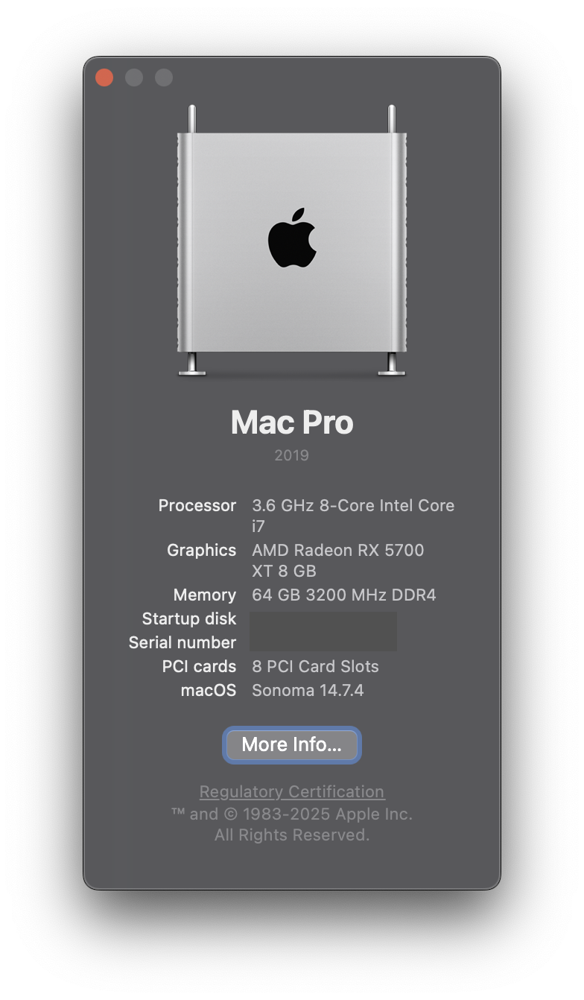

# Gigabyte z390 Designare Hackintosh 

**Status: Success | Stable**


[](https://github.com/acidanthera/OpenCorePkg)  [](https://www.apple.com/macos/ventura) [](https://www.apple.com/macos/sonoma-preview/)

**DISCLAIMER:**

As you embark on your Hackintosh journey you are encouraged to **READ** the entire README and [Dortania](https://dortania.github.io/getting-started/) guides before you start, or check out some [Youtube videos](https://www.youtube.com/c/TechNolli) to get an understanding of the install process. It will save many a message instructing you to read the manual. **I am not an expert**, I haven't forced you to do anything, so put on your big boy pants and take responsibility for any mess you get yourself into.

With that said I'm happy to help when/where I can. When you encounter bug or want to improve this repo, consider opening an issue or pull request. You can also find a wealth of knowledge on [Reddit](https://www.reddit.com/r/hackintosh/), [TonyMacX86](https://www.tonymacx86.com) or [Google](https://www.google.com).

## Introduction

<details> 
<summary><strong>This is not a guide!</strong></summary>


This is not a complete guide. It should only be used as a reference. I provide tips and tricks that I learned on my journey in building a hackintosh. The best way of using this is as a supplement to the OpenCore guide; if you have questions about how to setup your specific hardware, are unclear about what to do, or would like to see the settings I've used.

I understand that some may simply copy the EFI folder to their EFI partition. For clarity the EFI folder needs to go onto the EFI partition.

```EFI
EFI (partition)
	EFI
	├── BOOT
	├── OC
```

It should work and your Gigabyte z390 Designare based hackintosh should boot and work fine. **You will at minimum need to generate SMBIOS values if you want Apple services to work.** Note that all error reporting/logging has been turned off in the config.plist. You will have a difficult time trouble shooting with the setup provided. You can easily turn on the error reporting and logging if you follow the Dortania guide. Best of luck.

> **NOTE** if you simply wish to copy my EFI please do the following:
>
> 1. Properly set your [BIOS settings](https://github.com/seven-of-eleven/designare-z390-opencore-efi/blob/master/BIOS.md) (<kbd>Del</kbd> to get into bios)
> 2. [Generate SMBIOS values](https://dortania.github.io/OpenCore-Install-Guide/config.plist/coffee-lake.html#platforminfo) and add them in the config.plist (MacPro7,1)
> 3. **Rename** one of the `config...` files in the OC folder to `config.plist` (see release or notes below for details).
> 4. Prepare your install [USB](https://dortania.github.io/OpenCore-Install-Guide/installer-guide/)
> 5. Move the entire EFI folder (with your modifications) to the proper partition on your [USB](https://dortania.github.io/OpenCore-Install-Guide/installer-guide/mac-install.html#setting-up-opencore-s-efi-environment) (or [hard drive](https://dortania.github.io/OpenCore-Post-Install/universal/oc2hdd.html) once the install is complete).
> 6. [Install](https://dortania.github.io/OpenCore-Install-Guide/installation/installation-process.html#double-checking-your-work) - You need to select <kbd>F12</kbd> to get the boot menu options and **boot from the USB each time the computer restarts** until you've copied the EFI folder onto the hard drive. You may also need to select the correct boot option during install, although this is typically done automatically.

</details>  

<details> 
<summary><strong>This is a guide!</strong></summary>


To install macOS follow the guides provided by [Dortania](https://dortania.github.io/OpenCore-Install-Guide/) :thinking:

</details>  


<details>
<summary><strong>⚠️ HIGHLIGHTED CHANGES FROM PREVIOUS EFI ⚠️</strong></summary>


#### Choose your config

- Choose your preferred config.plist file and **rename it to config.plist**:

  - config-no-wifi-bt.plist - `disables the internal WiFi and bluetooth`
    - most similar to older Releases. Use this if you have installed a 3rd party PCIE WiFi/bt card (Fenvi or other).
    - all WiFi and Bluetooth related kexts are disabled. If you need BluetoolFixup for your card you'll need to enable it.  Also the child items listed below are commented out, simply remove the '#' at the front of the key value to enable them.
  - config-wifi-bt.plist - `enables builtin WiFi and bluetooth`
    - use this if you **don't have** PCIE card but want to enable **builtin Intel WiFi/bt**
    - Kexts provided for Ventura, and Sonoma. Restricted by Min/Max Version values.

</details>


<details> 
<summary><strong>Update or fresh install instructions for 14.4+</strong></summary>


When updating from 14.x to 14.4+, or installing 14.4+ the following is recommended:

- Set **SecureBootModel** to **Disabled** (not *default*)
- Disable all WiFi kexts if any
- Disable all Bluetooth kexts if any
- Add`revpatch=sbvmm` to  **boot-args** (if you want to update through the System Settings, otherwise just download the full installer)

After updating:

- Reset **SecureBootModel** to **Default** (or **j160** for MacPro7,1)
- Enable all WiFi and Bluetooth kexts (latest versions already included in the EFI)

> Note: All WiFi and Bluetooth kexts in the release are enabled by default.

</details>


<details> 
<summary><strong>Shout out and credits</strong></summary>


**Shout out** to [baughmann](https://github.com/baughmann) the OG of this repo. He entrusted it to my care while he's moving on to bigger and better things. All the best to him and many thanks for his contribution.

[Applebreak1 - z390-Designare-Customac](https://github.com/AppleBreak1/Z390-Designare-Customac) - I used notes from him and CaseySJ to get Thunderbolt working

#### Credit to all these great people whom I don't know but have made my hackintosh dreams come true:

- [EETagent](https://github.com/EETagent) for his repository (I like the layout of his guide and used it to create this one)
- The guys from [Acidanthera](https://github.com/acidanthera) that make this possible
- [Apple](http://apple.com) for macOS and HfsPlus.efi
- [corpnewt](https://github.com/corpnewt) for [USBMap](https://github.com/corpnewt/USBMap) and [CPUFriendDataProvider](https://github.com/corpnewt/CPUFriendFriend)
- [headkaze](https://github.com/headkaze) for [Hackintool](https://github.com/headkaze/Hackintool)
- [Mieze](https://github.com/Mieze) for [IntelMausiEthernet](https://github.com/Mieze/IntelMausiEthernet)
- People at [r/hackintosh](https://www.reddit.com/r/hackintosh/) for their advice and help
- Useful tools by [CorpNewt](https://github.com/corpnewt) and [headkaze](https://github.com/headkaze/Hackintool)
- CaseySJ [Gigabyte Designare Z390 build](https://www.tonymacx86.com/threads/success-gigabyte-designare-z390-thunderbolt-3-i7-9700k-amd-rx-580.316533/)
- And every other contributor

</details>

<details>
<summary><strong>Benchmarks (Geekbench 5) 🏎</strong></summary>
<br>


CPU:

- Single-core: [1174](https://browser.geekbench.com/v5/cpu/16318404)
- Multi-core: [7891](https://browser.geekbench.com/v5/cpu/16318404)

Compute (GPU):

- Metals: [79919](https://browser.geekbench.com/v5/compute/5218510)
- OpenCL: [69506](https://browser.geekbench.com/v5/compute/5244655)

</details>

<details>
<summary><strong>Hardware</strong></summary>
<br>


[](https://download.gigabyte.com/FileList/BIOS/mb_bios_z390-designare_f9.zip?v=be589b6c41e6b8f340b5273a4982e394)

#### My system

| Category  | Component                                                    | Note                                                         |
| --------- | ------------------------------------------------------------ | ------------------------------------------------------------ |
| CPU       | Intel Core i7-9700k                                          | Other motherboard compatible CPUs shouldn't be an issue      |
| MB        | [Gigabyte Designaire Z390 (rev 1.0)](https://www.gigabyte.com/Motherboard/Z390-DESIGNARE-rev-10#kf) |                                                              |
| GPU       | Saphire Pulse RX 5700 XT                                     | `agdpmod=pikera` needed for 5000 & 6000 series AMD cards (key is set in config.plist) |
| NVME      | WD Black 250 GB                                              | Boot drive                                                   |
| NVME      | Crucial P3 4TB                                               | Home folder                                                  |
| NVME      | WD Black 1TB                                                 | Raid 0 - extra drive (using PCIE adapter)                    |
| NVME      | HP EX950 1TB                                                 | Raid 0 - extra drive  (using PCIE adapter)                   |
| SSD       | WD Blue  2TB                                                 | Video and photo storage                                      |
| SSD       | WB Blue  250GB                                               | Backup boot drive for testing OS update/upgrades             |
| HD        | Seagate Iron Wolf  6TB                                       | Used as internal time machine backup                         |
| Ethernet  | Intel I211 and Intel I219                                    | Dual Gigabit LAN (both working)                              |
| Memory    | 64GB / 3200MHz DDR4                                          |                                                              |
| WiFi & BT | Intel® CNVi interface 802.11a/b/g/n/ac                       | Works with regular Intel [WiFi/bluetooth limitations](https://openintelwireless.github.io/itlwm/FAQ.html#features) |
| Case      | [O11 Dynamic](https://lian-li.com/product/pc-o11-dynamic/)   | I have the white version.                                    |
| Monitor   | [LG UltraWide 49](https://www.lg.com/us/monitors/lg-49WL95C-W-ultrawide-monitor#) | 49" UltraWide 32:9 Dual QHD (5120 x 1440) IPS Display        |

#### baughmann's system

| Component | Product                           |
| --------- | --------------------------------- |
| CPU       | Intel Core i9 9900K               |
| MB        | Gigabyte Designaire Z390 (rev 10) |
| GPU       | AMD Radeon VII 16 GB              |
| SSD       | Samsung EVO 970 (NVMe - 1TB)      |

#### baughmann's other system

| Component | Product                                 |
| --------- | --------------------------------------- |
| CPU       | Intel Core i7 8700K                     |
| MB        | Gigabyte Designaire Z390 (rev 10) |
| GPU       | AMD Radeon VII 16 GB                    |
| SSD       | Samsung 860 EVO SSD (1TB)               |

#### Other Configurations

- [Without a dedicated GPU](https://github.com/baughmann/Catalina-Gigabyte-Designare-Z390-i9-9900k-EFI/issues/1)
- Other AMD GPU's are _probably mostly_ plug-n-play. Be sure to read the [fantastic Buyer's Guide by Dortania](https://dortania.github.io/GPU-Buyers-Guide/) before you buy!
- [Applebreak1 - z390-Designare-Customac](https://github.com/AppleBreak1/Z390-Designare-Customac)

</details>  

<details>
<summary><strong>Main software</strong></summary>
<br>


| Component    | Version |
| ------------ | ------- |
| macOS Sonoma | 14.4.1  |
| OpenCore     | v0.9.9  |

</details>


<details>
<summary><strong>ACPI Files</strong></summary>
<br>


| Component                |
| ------------------------ |
| SSDT-AWAC.aml            |
| SSDT-DMAR.aml            |
| SSDT-DTPG.aml            |
| SSDT-EC-USBX-DESKTOP.aml |
| SSDT-PMC.aml             |
| SSDT-SBUS-MCHC.aml       |
| SSDT-TB3.aml             |

</details>

<details>
<summary><strong>Kernel extensions</strong></summary>
<br>


| Kext                   | Version                                                  |
| :--------------------- | -------------------------------------------------------- |
| AppleALC               | 1.8.9                                                    |
| IntelMausi             | 1.0.7                                                    |
| Lilu                   | 1.6.7                                                    |
| RestrictEvents         | 1.1.3 - `only needed with SMBIOS MacPro7,1`              |
| SMCProcessor           | 1.3.2                                                    |
| SMCSuperIO             | 1.3.2                                                    |
| USBPorts               | 1.0.0                                                    |
| VirtualSMC             | 1.3.2                                                    |
| WhateverGreen          | 1.6.6                                                    |
| **Additional Kexts***  | Used to enable builtin WiFi and bluetooth                |
| AirportItlwm           | 2.2.0 - `enable WiFi on Ventura`                         |
| AirportItlwmS-14.0     | 2.3.0 alpha -`enable WiFi on Sonoma 14.0-14.3`           |
| AirportItlwmS          | 2.3.0 alpha - `enable WiFi on Sonoma 14.4+`              |
| BlueToolFixup          | 2.6.8                                                    |
| IntelBluetoothFirmware | 2.4.0                                                    |
| IntelBTPatcher         | 2.4.0                                                    |
| USBPortsWFBT           | 1.0.1 - `disables ports 11 & 12, and enable port 8 & 14` |

> **Additional Kexts** included in the EFI enable the internal WiFi and Bluetooth. The USB map used (USBPortsWFBT.kext) is changed to disable port 11& 12 and enable port 8 & 14. See the USB section below for more details.

</details>


<details>
  <summary><strong>UEFI drivers</strong></summary>
<br>


|       Driver        | Version           |
| :-----------------: | ----------------- |
|     HfsPlus.efi     | 1.0.0             |
|   OpenRuntime.efi   | OpenCorePkg 0.9.9 |
| ResetNvramEntry.efi | 0.9.9             |

</details>


<details>
    <summary><strong>Screenshots</strong></summary>
    <br>
    <p float="left">
        
    </p>
    <p float="left">
        
    </p>
</details> 


## Installation Notes

<details>  
<summary><strong>UEFI/BIOS settings</strong></summary>
<br>


> Note <kbd>DEL</kbd> key gets you into BIOS Setting during boot.

#### Update (or downgrade) your motherboard's BIOS firmware

Use BIOS version **F9i or F9** (don't use F9j). You can download F9i from this repo's [releases page](https://github.com/seven-of-eleven/designare-z390-opencore-efi/releases/tag/resources) or F9 (the latest version) from [Gigabyte's website](https://www.gigabyte.com/Motherboard/Z390-DESIGNARE-rev-10/support#support-dl-bios).

#### BIOS configuration

Visit the [BIOS configuration](https://github.com/seven-of-eleven/designare-z390-opencore-efi/blob/master/BIOS.md) page to ensure that your BIOS is configured properly.

>Note: If you've recently updated your BIOS firmware, you will need to double-check these as some of them get reset after updating!


<details>  
<summary><strong>Thunderbolt working</strong></summary>


- Added ACPI files and updated config to enable Thunderbolt


> **DiableIoMapper is set to false to enable AppleVTD** as outlined below. Set to true if you are having issues with your Fenvi WiFi BT card.

- Enabled AppleVTD

  - Since Monterey 12.3.0, AppleEthernetE1000 driver kit natively attaches to i211 ethernet. However, if the ethernet port is occupied without having AppleVTD enabled, the system will experience freeze, crash, and etc. To avoid having these issues, we need to enable AppleVTD.

  ```
  - Enable VT-d in BIOS, 
  - Set DisableIoMapper to false
  - Drop OEM DMAR Table in config.plist
  - Inject modified DMAR Table(Reserved Memory Regions removed) in config.plist
  ```

  - Removed AppleIGB kext as it's not needed with AppleVTD enabled.

</details>


</details>  


<details>
<summary><strong>Customizing the config.plist</strong></summary>
<br>


Read the official [OpenCore Desktop Guide for Coffee Lake](https://dortania.github.io/OpenCore-Install-Guide/config.plist/coffee-lake.html) when making changes to the `config.plist` and the guide's [Gather Files section](https://dortania.github.io/OpenCore-Install-Guide/ktext.html#firmware-drivers) when picking drivers and kexts.

The following fields have been replaced by `[REPLACEME]` (for ease of <kbd>⌘</kbd>+<kbd>F</kbd>):

- `config.plist` > `PlatformInfo`
  - `SystemSerialNumber`
  - `SystemUUID`
  - `MLB`
  - Follow the [OpenCore instructions](https://dortania.github.io/OpenCore-Post-Install/universal/iservices.html#generate-a-new-serial) to generate your own unique identifiers.
- Also replace the ROM value of `11223344 5566` as outlined in the [OpenCore Instructions](https://dortania.github.io/OpenCore-Post-Install/universal/iservices.html#fixing-rom)
- Choose a `SystemProductName`, either `iMac19,1` or `MacPro7,1` see **Generate your own SMBIOS** for details.
- All packages are `RELEASE` and debugging is disabled. If you're having issues, be sure to enable debugging [as described in the OpenCore docs](https://dortania.github.io/OpenCore-Install-Guide/config.plist/coffee-lake.html#debug), and also grab [the `DEBUG` version of OpenCorePkg](https://github.com/acidanthera/OpenCorePkg/releases).

> If you're not using internal WiFi/bt you can remove the **Additional Kexts** in the Kext listing and take a snapshot with Propertree to update your config file. If you don't know what this means, just ignore it, everything will work fine 😀.

</details>


<details>
<summary><strong>Own prev-lang-kbd</strong></summary>
<br>


In the config.plist file you set the default language as outlined in the guide. You can either add it as a string or as a hex data using [ProperTree](https://github.com/corpnewt/ProperTree)

The setting is found in the config.plist under: 

- NVRAM
  - 7C436110-AB2A-4BBB-A880-FE41995C9F82

Format is lang-COUNTRY:keyboard as shown below:

- 🇺🇸 | [0] en_US - U.S --> en-US:0 **OR** `656e2d55 533a30` in HEX

| Key           | Type   | Value   |
| ------------- | ------ | ------- |
| prev-lang:kbd | String | en-US:0 |

> Language is set to **English** but you can find alternatives here:
>
> [AppleKeyboardLayouts](https://github.com/acidanthera/OpenCorePkg/blob/master/Utilities/AppleKeyboardLayouts/AppleKeyboardLayouts.txt)

</details>


<details>  
<summary><strong>Ventura, or Sonoma?</strong></summary>


The EFI folder should work for either Ventura, or Sonoma. 

I would avoid installing Sonoma 14.4 as it had issues with USB mapping.

I'm primarily using this EFI with Sonoma 14.4.1 at the moment. Prior to this I was running Ventura without issue.

</details>  

<details>  
<summary><strong>Generate your own SMBIOS</strong></summary>


Use [GenSMBIOS](https://github.com/corpnewt/GenSMBIOS) to create your own serial #... based off of your preferred model.

- MacPro7,1 -`What I used`
  - **See below if you want to keep iMac19,1**

**Note:** If you use a different SMBIOS model other than MacPro7,1 or iMac19,1. The provided USB mapping **will not** work. You will need to edit the USBPorts.kext file.  You can right click on the file and select **Show Package Contents**.  From there you can open the Info.plist file in ProperTree and change MacPro7,1 to whatever Model ID you've chosen. This should provide a working USBPorts.kext.

### Keeping SMBIOS iMac19,1

If you've used a previous version from this repo and everything is working for you, **I would recommend you keep the iMac19,1 SMBIOS** so that you don't have to generate new serial numbers etc. In this case you can simply use Propertree to <kbd>delete</kbd> the entire `PlatformInfo` portion of the config.plist file and replace it (copy and paste) with the `PlatformInfo` from your existing config.plist file.

Alternatively you can manually update the `PlatformInfo` by adjusting the following:

| Key                | Type    | Value             |
| ------------------ | ------- | ----------------- |
| CustomMemory       | Boolean | False             |
| MLB                | String  | [REPLACEME] ^*^   |
| ROM                | Data    | 11223344 5566 ^*^ |
| SystemProductName  | String  | iMac19,1          |
| SystemSerialNumber | String  | [REPLACEME] ^*^   |
| SystemUUID         | String  | [REPLACEME] ^*^   |

##### *Replace these with your values

> **NOTE:** If you have everything working with your own USB mapping file. **KEEP IT.** Replace the provided USBPorts.kext file with the one in your existing EFI folder and perform a snapshot in Propertree for good measure.

</details>  


<details>  
<summary><strong>USB Mapping (active ports)</strong></summary>
<br>


> The latest version of USBPorts.kext included will work with either SMBIOS iMac19,1 or MacPro7,1.

MacOS has a fifteen port limit. You can read more about the details in the [guide](https://dortania.github.io/OpenCore-Post-Install/usb/). Depending on your specific needs you may want to customize/recreate the port mapping. 


<details>  
<summary><strong>USB Mapping - config-no-wifi-bt.plist (USBPorts.kext)</strong></summary>
<br>


This USBPorts.kext file provided enables the following ports:


For reference the associated ports are outlined in the following diagrams (modified from [CaseySJ](https://www.tonymacx86.com/threads/success-gigabyte-designare-z390-thunderbolt-3-i7-9700k-amd-rx-580.316533/)):


</details>


<details>  
<summary><strong>USB Mapping - config-wifi-bt.plist (USBPortsWFBT.kext)</strong></summary>
<br>


> Note the **difference from the USBPorts.kext** is the enabling of ports 8 & 14 and disabling of ports 11 & 12. This was done to **enable the internal WiFi and bluetooth**.


This USBPortsWFBT.kext file provided enables the following ports:


For reference the associated ports are outlined in the following diagrams (modified from [CaseySJ](https://www.tonymacx86.com/threads/success-gigabyte-designare-z390-thunderbolt-3-i7-9700k-amd-rx-580.316533/)):


</details>


</details>


<details>  
<summary><strong>Custom RAM Config</strong></summary>
<br>


> If you're using SMBIOS iMac19,1 you can safely ignore this and just ensure `Kernel>Add> RestrictEvents.kext`> `Enabled` is `False` in the config.plist file.

Using the **SMBIOS MacPro7,1** will require either `CustomMemory` to be configured **or** [RestrictEvents.kext](https://github.com/acidanthera/RestrictEvents) to be installed. I've enabled the RestrictEvents.kext as default. If you want to create the custom memory values the details can be found in the [guide](https://dortania.github.io/OpenCore-Post-Install/universal/memory.html).

</details>

<details>  
<summary><strong>Audio Setup</strong></summary>


There are three options available that I'm aware of. You can use alcid 7, 11, or 16. All three are used by different Designare EFIs available online. I'm using alcid 11 because it works for what I need. If you have specific audio requirements and alcid 11 isn't working try the other values. `Previous EFIs in this repo used alcid=7.`

> NOTE: Alcid values can be added to the 'NVRAM > boot-args' key **or** DeviceProperties. The boot-args value will override the DeviceProperties value if both are used. **You only need one**. This EFI uses the DeviceProperties method.

### Audio output quirks

3.5mm jack will show as Internal Speakers depending on the alcid you've chosen:

| alcid= | Front jack        | Rear jack         |
| ------ | ----------------- | ----------------- |
| 7      | Headphones        | Internal Speakers |
| 11     | Headphones        | Internal Speakers |
| 16     | Internal Speakers | Headphones        |


alcid decimal to hex value table

| Decimal | Hex value    |
| ------- | ------------ |
| 7       | 07000000     |
| **11**  | **0B000000** |
| 16      | 10000000     |

### Audio setting method used in EFI

DeviceProperties>Add

| Key                        | Type       | Value        |
| -------------------------- | ---------- | ------------ |
| PciRoot(0x0)/Pci(0x1F,0x3) | Dictionary |              |
| layout-id                  | Data       | **0B000000** |

</details>

## Status

<details>  
<summary><strong>What's working ✅</strong></summary>


- [x] GPU hardware acceleration / performance
- [x] iMessage, FaceTime, App Store, iTunes Store. `Generate your own SMBIOS`
- [x] Intel I219-V Ethernet port
- [x] Intel I211 Ethernet port
- [x] Internal WiFi and bluetooth - `WiFi not fully tested on Ventura`
- [x] Audio jacks - `front and rear 3.5mm audio jacks work with quirks (see Audio Setup for details)`
- [x] Shutdown / Restart / Sleep
- [x] USB 3.0/3/1 - `USB map created.`
- [x] Graphical Boot menu `OpenCanopy (I included it in the EFI but I don't use it as I generally skip the boot menu.)`
- [x] Thunderbolt
- [x] Sidecar - `reported working, I haven't tested`
- [x] Conitunity Camera - `working when iPhone is connected by USB`
- [x] WiFi on Ventura - `works but I primarily use Ethernet`

</details>  

<details>  
<summary><strong>What's not working ⚠️</strong></summary>


- [ ] All empty . Your hack should work wonderfully.

</details>  

<details>  
<summary><strong>Untested 🧪</strong></summary>


- [ ] Boot chime - `should work I just haven't bothered`
- [ ] FileVault - `should work I just haven't tried it`
- [ ] Windows/Linux from OC boot menu - `I'm not dual booting my system but there's no reason it shouldn't work. May require some EFI changes.`

</details> 

<details>  
<summary><strong>Change log 🪵</strong></summary>


- **26 Mar 2024**
  - Update to OpenCore 0.9.9
  - All kexts update to the latest version at time of release
  - Dropped Monterey in the EFI - `can use a previous release for Monterey`
  - Sonoma - Issues with Fenvi cards remain (can be patched using OCLP)
  - Cleaned up the config.plist file removing unneeded keys
  
- **15 Nov 2023**
  - Update to OpenCore 0.9.6
  - All kexts at latest available versions
  - Sonoma support added and working
  - Sonoma - WiFi support broken with Fenvi cards (can be fixed with OCLP)
- **9 Aug 2023**
  - Updated to OpenCore 0.9.4

  - Added NVRAM key values for Bluetooth fix for Ventura 13.4+

  - Updated all kexts to latest available versions
- **16 May 2023**
  - Update to OpenCore 0.9.2
  - Disable CaseySJ patch and enable new DisableIoMapperMapping quirk (addresses the same issue)
  - Updated all kexts to latest available versions
- **8 Mar 2023**
  - Update to **OpenCore 0.9.0**
  - Dropped support for BigSur (can use previous EFI versions if needed)
    - removed BigSur kexts

  - Enabled Thunderbold support (tested with OWC Thunderbolt Dock)
  - Updated BIOS to F9
  - Enabled AppleVTD
- **21 Dec 2022**
  - Update to **OpenCore 0.8.7**
  - Enable/disable internal WiFi and bluetooth - `rename your chosen config.plist`
  - Moved to primarily booting Ventura 13.1 (using ethernet, not WiFi)
- **14 Oct 2022**
  - Update to **OpenCore 0.8.5**
  - Enable internal WiFi and bluetooth in **EFI 2** - see Releases
  - Change of USB port mapping in **EFI 2** for internal bluetooth
- **8 Sept 2022**
  - Update to **OpenCore 0.8.4**
  - Include SmallTree kext for BigSur (disabled for Monterey with MaxVersion value)
  - Enable `DisableIoMapper` by default to resolve networking issues [#67](https://github.com/seven-of-eleven/designare-z390-opencore-efi/issues/67)
  - Ventura beta remains bootable and working
- **7 Aug 2022**
  - Minor update to README added USB mapping changes

  - USBPorts.kext modified to be used with either SMBIOS `iMac19,1` or `MacPro7,1` 
  - **NOTE**: Old USBPorts.kext for SMBIOS `iMac19,1` referenced `iMacPro19,1` incorrectly [#61](https://github.com/seven-of-eleven/designare-z390-opencore-efi/issues/61) and may not have been working properly.


- **6 Aug 2022**
  - Transfer of repo from baughmann to seven-of-eleven
  - Update to **OpenCore 0.8.3**
  - Updated readme format/details
  - Change of SMBIOS from `iMac19,1` to `MacPro7,1` only b/c that's what I'm using
  - Change alcid from 7 to 11
  - Ventura beta 4 is bootable and working
- **11 October 2021**
  - Updated to OpenCore 0.7.4
  - No longer need `slide=0`
  - Removed a bunch of hacky stuff (including USB ports unlimiter)
  - Rebuilt `config.plist` from the ground-up to remove legacy crap that has built up over time
  - Boot times seemed to have improved
  - Tried and failed to use BIOS version F9j
- **30 May 2021:**
  - Confirmed compatability with Big Sur 11.4
- **10 April 2021:**
  - Updated OpenCore to 0.6.9
  - Fixed USB port issue occurring after upgrade to 11.3 by re-disabling `USBInjectAll.kext`, re-enabling `USBPorts.kext` (this mobo's USB map) and setting `Kernel` > `Quirks` > `XhciPortLimit` to `0`
  - Updated all kexts and drivers that needed updating
- **10 April 2020:**
  - Updated OpenCore to 0.6.8
  - Updated all Kexts and Drivers for which there was an update
  - Fixed all non-fatal warnings at startup
  - Ensured compatability with macOS Big Sur 11.2.3 (20D91)
- **15 December 2020:**
  - Updated to OpenCore 0.6.4
  - Updated All Kexts and Drivers for which there was an update
  - Ensured compatability with macOS Big Sur 11.1 (20C69)
- **1 December 2020:**
  - Modified BIOS suggestions to get Sidecar working _(thanks @QueercoreTrash for [#19](https://github.com/seven-of-eleven/designare-z390-opencore-efi/issues/19))_
  - Added a [BIOS configuration page](https://github.com/seven-of-eleven/designare-z390-opencore-efi/blob/master/BIOS.md) with screenshots for user assistance.
- **16 Nov 2020:**
  - Updated to macOS Big Sur from Catalina
  - For some reason, with Big Sur and OC 0.6.3, we no longer need AirportBrcmFix for the Fenvi BT/WiFi Card
  - Changed `slide=1` to `slide=0`
  - Kept `USBPorts.kext` inside the `config.plist`, but disabled it because it seems as though `USBInjectAll.kext` does the trick
- **13 August 2020:**
  - Verified that supplemental update 10.15.6 `19G73` => `19G2021` works without issues.
- **10 August 2020:**
  - Added `SmallTreeIntel82576.kext` for enabling the secondary Ethernet port
- **4 August 2020:**
  - Updated OC to version [0.6.0](https://github.com/acidanthera/OpenCorePkg/releases/tag/0.6.0)
  - Updated all of [the acidanthera's](https://github.com/acidanthera) drivers and kexts
- **1 August 2020:**
  - Updated OC to version [0.5.9](https://github.com/acidanthera/OpenCorePkg/releases/tag/0.5.9)
  - Updated all kexts and drivers to the latest
  - Removed `ApfsDriverLoader.efi` because it was rolled into OC starting with 0.5.9
- **13 June 2020:**
  - Updated OC, Kernel Extensions, and Drivers to be compatible with latest macOS update `10.15.5` (and supplemental update).
  - Somehow the boot picker remembers my choice now, meaning that emulated NVRAM is somehow working?
  - _IMPORTANT:_ Upgraded from `DEBUG` to `RELEASE`:
    - Changed all drivers and OC files from the `DEBUG` versions to `RELEASE` versions because I seem to have a stable system.
    - Modified `config.plist` to no longer generate logs (log level now `0`).
    - If you're having problems, switch back to `DEBUG` mode yourself by following [this guide](https://dortania.github.io/OpenCore-Desktop-Guide/troubleshooting/debug.html).

</details>
